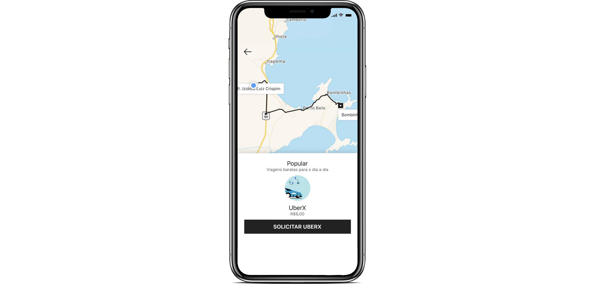

<h1 align="center">
    
</h1>

<h4 align="center">
  🚀 Vídeo Youtube by RocketSeat
</h4>

  
  

  

## 👨🏼‍💻 Projeto

O Uber clone é um projeto feito para estudo e treinamento de `React Native`. Foi feito uma copia da pagina inicial do Uber com as funcionalidades de buscar um endereço utílizando a API de mapas e rotas do google. Além disso, o sistema traça a rota no mapa da origem até o destino.

## 🔨 Tecnologias

- [JavaScript](https://developer.mozilla.org/pt-BR/docs/Aprender/JavaScript)
- [React Native](https://facebook.github.io/react-native/)
- [Expo](https://expo.io/)

## 🔄 Executar
 - Fazer clone do repositório.

### 📱 Mobile
 - Executar `yarn install` para instalar dependências do projeto;
 - Executar `yarn start` para executar o projeto

## ♻️ Como contribuir
- Faça um fork desse repositório;
- Crie uma branch com a sua feature: `git checkout -b minha-feature`
- Commit suas mudanças: `git commit -m ':emoji: feat: My new feature'`
- Push a sua branch: `git push origin my-feature`

## 📝 Licença
Este projeto está sobre a licença MIT. Veja o arquivo [LICENSE](LICENSE.md) para mais detalhes.

---

<h4 align="center">
  Feito com ❤️ by Gustavo Souza
</h4>
